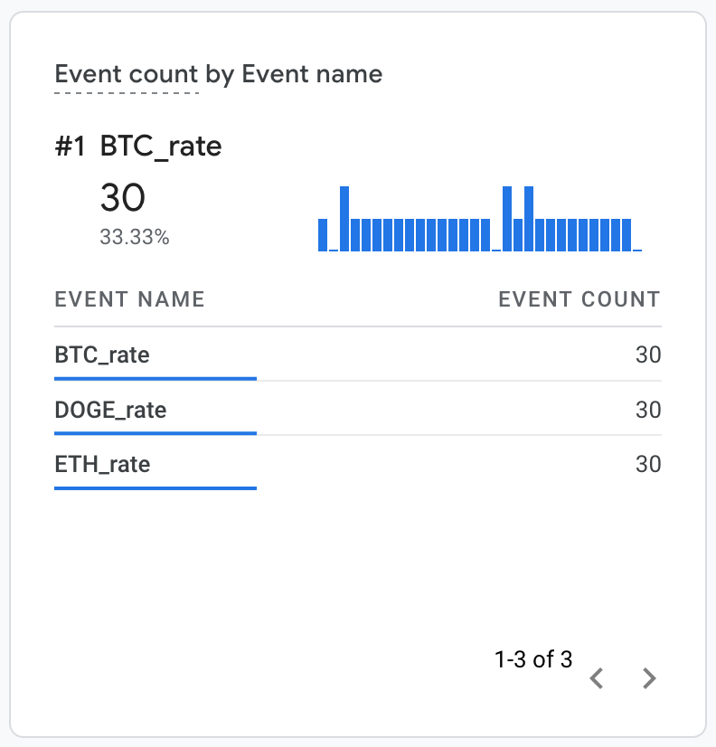
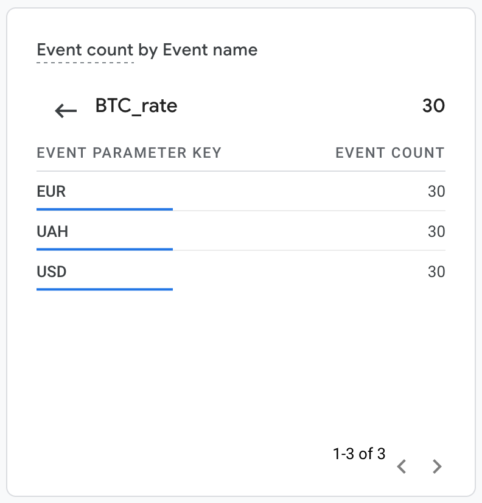
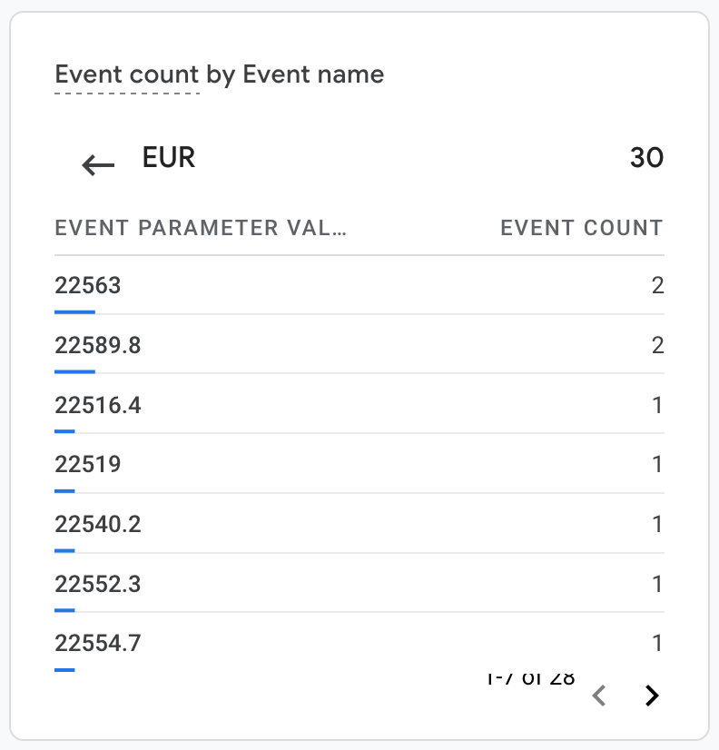
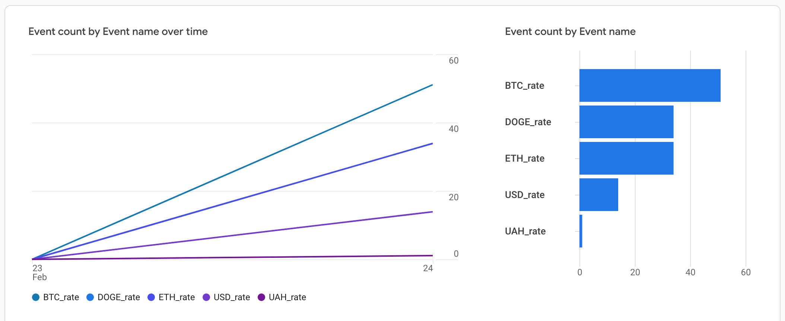
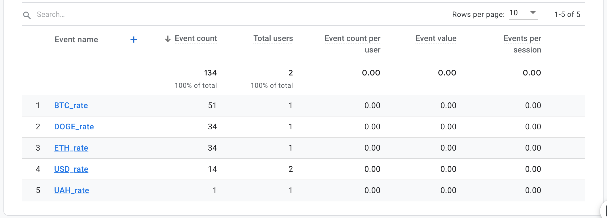
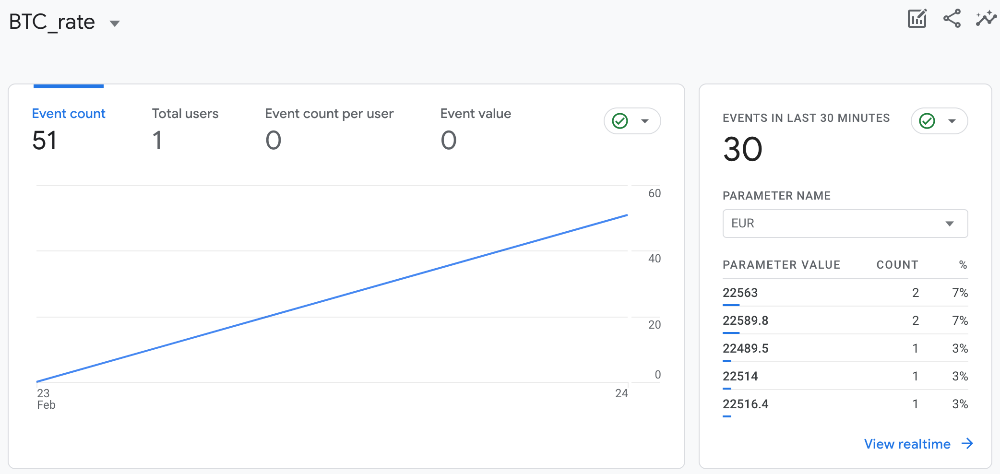

# Highload Software Architecture 8 Lesson 4 Homework

Presentation
---

Some reports on custom GA4 metrics I managed to create:

## Real-time metrics

|       Real time events       |        Single event        |        Event parameters        |
|:----------------------------:|:--------------------------:|:------------------------------:|
|  |  |  |

## Report 

